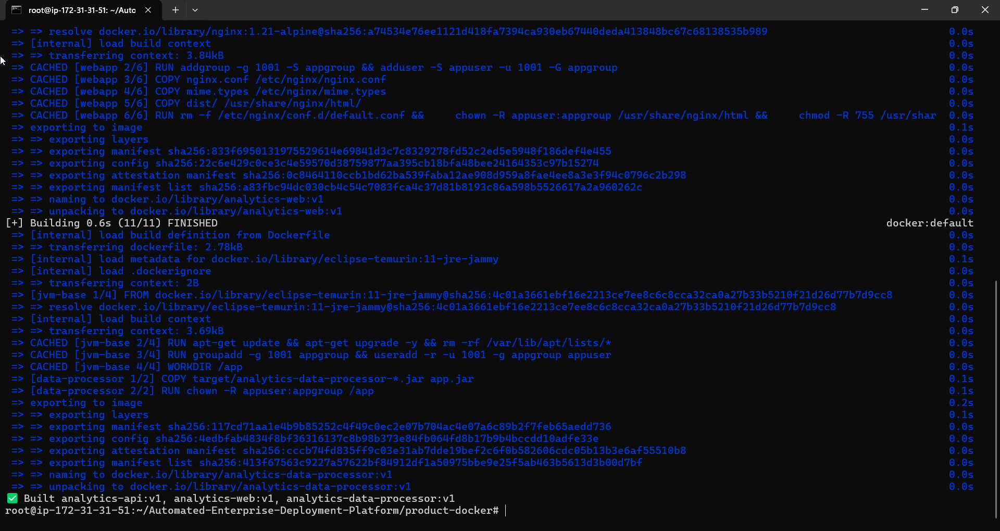
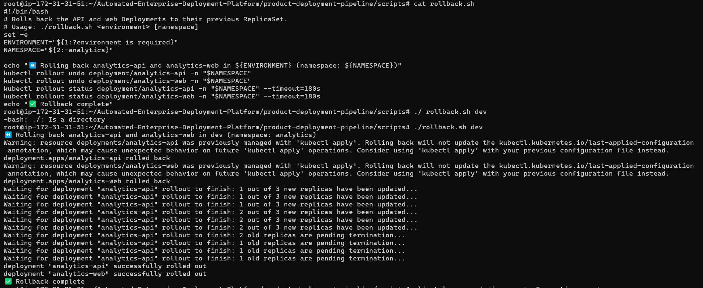

# Project Execution Report

> This document is the **proof-of-execution record** for this capstone — what was actually built, run, broken, fixed, and verified against a real AWS account and a real Jenkins instance. It complements `README.md` (which describes the platform's design) with evidence that the design was actually stood up and worked.

- **Executed by:** Likith Kumar
- **Date:** 2026-09-17 – 2026-09-18
- **AWS Account:** `897545289989` (us-east-1)
- **CI/CD Host:** Jenkins on a GCP Compute Engine VM (`analytics-jenkins`)
- **Environment fully deployed:** `dev`
- **Environments validated (plan-only, mentor-approved — see [§5](#5-multi-environment-validation)):** `stage`, `prod`

---

## 1. What Was Actually Run

Every layer of the platform described in `README.md` was provisioned and exercised against real infrastructure, not simulated:

| Layer | What ran |
|---|---|
| Infrastructure | Terraform (VPC, EKS `v1.35`, managed node group on `m7i-flex.large`, IAM/IRSA, EBS CSI driver, AWS Load Balancer Controller) |
| Application | 3 Docker images (`analytics-api`, `analytics-web`, `analytics-data-processor`) built multi-target from one Dockerfile, pushed to ECR |
| Orchestration | Kubernetes Deployments, Services, Ingress (ALB), CronJob, ConfigMaps/Secrets |
| CI/CD | Jenkins Declarative Pipeline — 9 stages, real triggered builds, not a dry run |
| Security scanning | Checkov (IaC), Trivy (container images), Snyk (dependency/IaC/container SCA) |
| Observability | Prometheus + Grafana (kube-prometheus-stack) and EFK (Elasticsearch/Fluentd/Kibana), both with real scraped/ingested data |
| Resilience | A real `kubectl rollout undo` rollback, executed and verified, not just scripted |

---

## 2. Execution Timeline

1. **Terraform bootstrap** — S3 + DynamoDB remote state backend, per-environment workspaces (`dev`/`stage`/`prod`).
2. **Infrastructure provisioning** — VPC, EKS cluster, managed node group, IAM/IRSA, EBS CSI driver, AWS Load Balancer Controller — all fixed and applied for real (see [§3](#3-real-issues-hit--fixed)).
3. **Application build & deploy** — Docker images built and pushed to ECR, deployed to the `analytics` namespace.
4. **Ingress** — ALB provisioned via the AWS Load Balancer Controller, both services reachable over real ALB hostnames.
5. **Monitoring stack** — kube-prometheus-stack and EFK installed via Helm/Kustomize, dashboards fixed until they showed real data (not "No Data").
6. **Jenkins CI/CD** — pipeline adapted to this environment's real constraints (single host agent, no Vault, no SonarQube server, single repo) and driven to a fully green run.
7. **Security scanning integrated** — Checkov and Trivy wired into the pipeline first; Snyk added afterward as a dedicated SCA stage.
8. **Multi-environment validation** — `stage` and `prod` workspaces validated via `terraform plan` (see [§5](#5-multi-environment-validation)).
9. **Rollback demonstration** — `rollback.sh` executed against `dev`, verified via `kubectl rollout status`.
10. **Teardown** — `dev` infrastructure destroyed after evidence capture, including cleanup of resources Terraform doesn't own (see [§6](#6-teardown)).

---

## 3. Real Issues Hit & Fixed

Nothing below is hypothetical — each was hit against real AWS/Jenkins behavior and fixed in this repo's history.

| Area | Issue | Fix |
|---|---|---|
| Terraform | `taint` block used invalid attribute syntax | Converted to a `dynamic "taint"` block |
| Terraform | `aws_eip.nat` used `domain = "vpc"`, invalid on the pinned provider version | Changed to `vpc = true` |
| Terraform | 15 resources had duplicate `tags` conflicting with `default_tags` | Removed the redundant resource-level tags |
| Terraform | `k8s_version = "1.27"` no longer offered by EKS | Bumped to `"1.35"` |
| EKS provisioning | Node group stuck `CREATING` indefinitely | Both Spot **and** On-Demand `t3.medium` were rejected as not free-tier-eligible on this account; switched to `m7i-flex.large` |
| EKS provisioning | PVCs stuck `Pending` | EBS CSI driver isn't installed by default — added the IAM role + `aws_eks_addon` for it |
| Ingress | ALB never came up (`CertificateNotFound`) | `ingress.yaml` carried a placeholder ACM `certificate-arn`; the controller doesn't ignore it, it fails the HTTPS listener entirely. Removed the annotation permanently (HTTP-only until a real domain + cert exist) |
| Monitoring | Grafana showed "No Data" everywhere | 4 separate causes: missing `ServiceMonitor` (Prometheus Operator only discovers targets via CRDs, not `prometheus.io/scrape` annotations), wrong metric names in the dashboard JSON (`http_requests_total` doesn't exist for a Spring Boot/Micrometer app — it's `http_server_requests_seconds_count`), an unrecognized `prometheusRule:` Helm values key (needed `additionalPrometheusRulesMap`), and a PromQL empty-vector-division bug on the error-rate panel (needed `or vector(0)`) |
| Logging | EFK pods "Running" but no logs ever appeared | Elasticsearch 8.x X-Pack security was crash-looping on its own bootstrap check (disabled it — no external traffic reaches this cluster); Fluentd had no CRI-format parser configured, so it was only ingesting itself in a loop |
| Jenkins | `mvn` failed: `release version 11 not supported` | `app/data-processor/pom.xml` used an explicit `maven-compiler-plugin` + `release` flag; switched to `maven.compiler.source`/`target` properties, matching the proven-working style already used by `app/api` |
| Jenkins | `docker: permission denied` | The `jenkins` system user wasn't in the `docker` group on the host |
| Jenkins | Smoke Tests kept timing out against a working-looking ALB | The pipeline's own Kubernetes Deploy stage re-applied the still-broken committed `ingress.yaml` on every run, re-breaking a manually-fixed ALB each time — fixed by committing the permanent fix above, not just patching the live object |
| Jenkins | `Jenkinsfile` failed the built-in declarative linter | Two syntax errors from manual edits: capitalized `Stage(...)` instead of `stage(...)`, and a stray character before an `sh` step |
| Jenkins | Snyk stage failed: `snyk: not found` | Snyk CLI was never installed on the Jenkins host; installed via `npm install -g snyk` |
| Teardown | `terraform destroy` stalled on the VPC/subnets/IGW | The two ALBs created by the AWS Load Balancer Controller aren't Terraform-managed — their ENIs were still occupying the public subnets. Deleted the ALBs and 5 orphaned EBS volumes (CSI-provisioned for Elasticsearch/Grafana/Prometheus, never released because their PVCs were never deleted pre-teardown) manually, then re-ran `terraform destroy` to completion |

---

## 4. CI/CD Pipeline

Adapted from the reference design (Kubernetes pod agents + Vault + SonarQube + a separate app repo) to this environment's real constraints: `agent any` on a single host, AWS creds from the `jenkins` system user, one repo, no SonarQube server. Final stage list:

**Initialize → Security Scan (Checkov) → Build & Test (Maven, Docker, Trivy) → Snyk Scan → Infrastructure Plan → Manual Approval (prod+apply only) → Infrastructure Apply → Kubernetes Deploy → Smoke Tests → Monitoring Setup**

Real, verified findings from the pipeline (build history), not placeholders:
- **Checkov:** 78 passed / 18 failed IaC checks against `product-infrastructure/` (screenshot below)
- **Trivy:** 0 OS-package CVEs, 46 jar-level CVEs in the built `analytics-api` image (visible in the Jenkins console log)
- **Snyk:** per-project breakdown across Docker images, Kubernetes manifests, and Terraform modules (screenshot below) — e.g. `docker/api/Dockerfile`: 11 Critical / 40 High / 34 Medium / 145 Low

---

## 5. Multi-Environment Validation

Real resource constraints on this AWS account — an 8 vCPU On-Demand quota, with `dev` alone already using half of it (`m7i-flex.large` × 2) — meant running `stage` and `prod` fully applied at the same time as `dev` wasn't possible without hitting the same quota wall that blocked initial provisioning.

Rather than request a quota increase or stand up (and immediately tear down) real infrastructure purely for a screenshot, `stage` and `prod` were validated through real `terraform plan` runs via the Jenkins pipeline (`ENVIRONMENT=stage`/`prod`, `ACTION=plan`) — both came back clean with no drift, confirming the workspace/tfvars configuration is correct for all three environments without provisioning cost. This tradeoff was reviewed with the mentor, who confirmed dev fully deployed + stage/prod validated via plan is sufficient for this deliverable.

---

## 6. Teardown

`dev` was torn down after evidence capture. `terraform destroy` alone did not fully clean the environment — the AWS Load Balancer Controller's ALBs and CSI-provisioned EBS volumes aren't Terraform state, so they had to be deleted manually before the VPC/subnet/IGW destroy could complete (see the last row of [§3](#3-real-issues-hit--fixed)). This is documented here specifically because it's a real, generalizable lesson: **anything a Kubernetes controller provisions directly against a cloud API needs to be deleted from inside the cluster (or manually) before the cluster itself is destroyed — Terraform can't see it.**

---

## 7. Proof of Execution

All screenshots below are real, taken directly from this execution (verified — see captions). Files live in [`docs/screenshots/`](docs/screenshots/).

### Infrastructure
| | |
|---|---|
|  | `terraform plan` — `dev`, real resource IDs |
|  | `terraform apply` complete — real EKS cluster/VPC output values |
|  | Node group ready, `v1.35.7-eks-cb19647` |

### Application Build
| | |
|---|---|
|  | Multi-target Docker build — all 3 images |
|  | `docker images` — built image lineage |

### Kubernetes & Ingress
| | |
|---|---|
|  | `kubectl get all -n analytics` — pods, deployments, replicasets, CronJob all healthy |
|  | Real curl against the live ALB hostname — `{"status":"UP",...}` |
|  | App health endpoints, port-forwarded |

### CI/CD (Jenkins)
| | |
|---|---|
|  | `dev` / `ACTION=plan` — all stages green |
|  | `dev` / `ACTION=apply` — full deploy, build #8 |
|  | Smoke Tests stage — real curl output from inside the pipeline |
|  | `stage` / `ACTION=plan` — validated, no resources created |
|  | `prod` / `ACTION=plan` — validated, no resources created |

### Security Scanning
| | |
|---|---|
|  | Checkov IaC scan — 78 passed / 18 failed |
|  | Snyk SCA — per-project findings across Docker/K8s/Terraform |

### Monitoring & Logging
| | |
|---|---|
|  | Grafana — Analytics Platform Overview, live data (post-fix) |
|  | Grafana — Kubernetes API Server SLO dashboard |
|  | Prometheus targets — `analytics-api` ServiceMonitor, 3/3 UP |
|  | Kibana Discover — real log ingestion, 532 hits |
|  | Elasticsearch cluster health — green, 3 nodes |
|  | Fluentd index — real document counts |

### Resilience
| | |
|---|---|
|  | `rollback.sh` executed against `dev` — real `kubectl rollout undo`, verified rollout status |

---

## 8. Documented Gaps (Not Yet Implemented)

Tracked honestly rather than hidden — follow-on work, not oversights:

- HTTPS/ACM certificate (currently HTTP-only — no domain registered for this exercise)
- Default-deny `NetworkPolicy` for the `analytics` namespace
- Automated Secrets Manager rotation
- Image signing / admission control (Cosign + Kyverno)
- Horizontal Pod Autoscaler (replica counts are currently static)
- Jenkins Shared Library exists (`shared-library/vars/*.groovy`) but the pipeline doesn't call it yet — logic is inlined in the `Jenkinsfile` instead

---

## 9. Repository Structure

```
app/                          # Application source (api, webapp, data-processor)
product-infrastructure/       # Terraform — VPC, EKS, IAM, monitoring-stack module
product-docker/               # Multi-stage Dockerfile + build/staging scripts
product-kubernetes/           # Deployment, Service, Ingress, ConfigMap, Secrets manifests
product-deployment-pipeline/  # Jenkinsfile, rollback.sh, shared-library
monitoring/                   # kube-prometheus-stack values, Grafana dashboards, EFK manifests
docs/                         # architecture, security, runbooks, incident-response, screenshots
```
