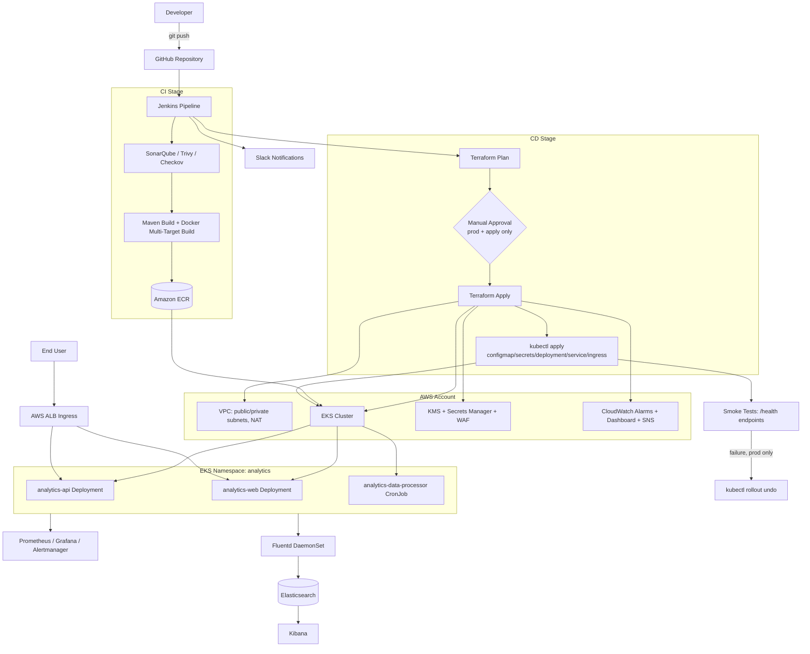
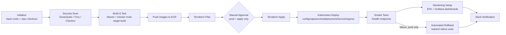

# Automated Enterprise Deployment Platform

> Production-grade Infrastructure-as-Code and CI/CD platform for deploying a multi-service enterprise analytics product onto AWS EKS — with environment-isolated Terraform, security-gated Jenkins pipelines, and a dual-layer observability stack.

---

## 1. Project Overview

| | |
|---|---|
| **Project Name** | Automated Enterprise Deployment Platform |
| **Domain** | Product-Based Technology — Enterprise Analytics |
| **Project Type** | DevOps / Platform Engineering (Infrastructure-as-Code + CI/CD) |
| **Target Users** | DevOps/Platform Engineers, SRE teams, Customer Success/Support Engineers, Security & Compliance reviewers |

This repository is the deployment backbone for a self-hosted, data-intensive enterprise analytics product. It does not contain the product's application source code — it contains everything required to build, secure, provision, deploy, and observe that product consistently across multiple customer-facing environments.

**Business value:** analytics products sold as self-hosted software are traditionally deployed by hand, environment by environment, which produces configuration drift, slow onboarding, and inconsistent security posture per customer. This platform replaces that with one Terraform codebase parameterized per environment, one CI/CD pipeline enforcing the same security gates everywhere, and one Kubernetes manifest set deployed identically regardless of target — trading manual, error-prone rollout for a repeatable, auditable process.

---

## 2. Business Problem

Self-hosted enterprise software is expensive to operate at scale when every deployment is a bespoke effort:

- **Inconsistent deployments** — each environment provisioned slightly differently leads to "works in one customer's cluster, breaks in another."
- **High support cost** — environment-specific issues consume Support/Customer Success time that scales linearly with customer count instead of staying flat.
- **Slow time-to-value** — manual provisioning and deployment steps delay how quickly a new environment can go live.
- **Compliance exposure** — without codified, auditable infrastructure and security gates, proving control effectiveness to security/compliance stakeholders is difficult.

This platform addresses those problems by moving environment definition into version-controlled Terraform workspaces and by making every deployment go through the same scanned, approved, logged pipeline — regardless of which environment it targets.

---

## 3. Objectives

**Technical objectives**
- Provision AWS infrastructure (VPC, EKS, IAM, KMS, WAF, monitoring) entirely through Terraform, with zero manual console changes.
- Run identical Kubernetes manifests across `dev`, `stage`, and `prod`, varying only cluster sizing and access controls.
- Gate every deployment behind static analysis, container scanning, and infrastructure scanning.
- Give the platform team both AWS-native (CloudWatch) and in-cluster (Prometheus/Grafana/EFK) visibility.

**Business objectives**
- Reduce the marginal effort of standing up or updating a customer environment.
- Establish a documented, defensible security and incident-response posture.
- Keep infrastructure cost visible and tunable per environment (spot capacity, NAT topology, retention windows).

**Expected outcomes:** repeatable environment provisioning, a single audit trail (Terraform state + Jenkins build history) per deployment, and a documented recovery path for common failure modes (see [§16](#16-challenges--learnings) and `docs/incident-response.md`).

---

## 4. Key Features

| Feature | Description | Business Benefit |
|---|---|---|
| Workspace-driven Terraform | One root config in `product-infrastructure/`, differentiated per environment via `terraform.workspace` and `environments/<env>/<env>.tfvars` | Eliminates drift between environment definitions; onboarding a new environment is a `.tfvars` file, not a new codebase |
| Multi-target Docker build | Single `Dockerfile` with `api`, `webapp`, and `data-processor` build targets sharing a common JVM base | One image lineage to patch and scan instead of three divergent Dockerfiles |
| Security-gated CI/CD | SonarQube, Trivy, and Checkov run as blocking pipeline stages before any deploy | Vulnerable code, images, or infrastructure changes cannot reach production |
| Manual approval gate for production | Jenkins `input` step, 1-hour timeout, required only when `ENVIRONMENT=prod` and `ACTION=apply` | Enforces human sign-off on production infrastructure changes without slowing lower environments |
| Automated rollback on failure | Pipeline `post { failure { ... } }` block runs `kubectl rollout undo` for production deployments | Bounds blast radius of a bad production deploy without waiting for manual intervention |
| Spot-capacity node groups | Tainted, dedicated `spot` node group in stage/prod alongside an on-demand `general` group | Lowers compute cost for interruption-tolerant workloads (e.g., the hourly data-processor CronJob) |
| Dual-layer observability | CloudWatch alarms/dashboard (AWS-native) plus an in-cluster Prometheus/Grafana/Alertmanager stack and EFK logging | Infrastructure-level and application-level visibility from two independent, mutually-redundant sources |
| KMS-encrypted secrets envelope | EKS secrets encryption via a dedicated KMS key; Secrets Manager containers with rotation-ready structure | Meets baseline enterprise expectations for encryption-at-rest of sensitive configuration |
| WAF rate limiting | Regional `aws_wafv2_web_acl` with AWS managed rule set plus a per-environment rate limit | Baseline edge protection against common web exploits and request floods |

---

## 5. Architecture Diagram



**Component interactions:** Jenkins is the sole orchestrator — it checks out this infrastructure repository and a separate application source repository, runs security scans, builds and pushes container images, plans/applies Terraform, and applies Kubernetes manifests in sequence. AWS resources (VPC, EKS, security baseline, monitoring) are provisioned by four independent Terraform modules composed from one root configuration.

**Request flow:** external traffic reaches the two ALB Ingress resources (`analytics-api`, `analytics-web`), which route to their respective ClusterIP Services and on to the `analytics-api`/`analytics-web` Deployments running in the `analytics` namespace.

**Data flow (observability):** application logs are collected cluster-wide by a Fluentd DaemonSet and shipped to Elasticsearch for querying via Kibana; application and cluster metrics are scraped by Prometheus and visualized in Grafana; infrastructure-level metrics (node CPU/memory) are additionally captured by CloudWatch alarms defined directly in Terraform, independent of the in-cluster stack.

---

## 6. Tech Stack

### Infrastructure & Provisioning

| Technology | Purpose |
|---|---|
| Terraform (`>= 1.0.0`, AWS provider `~> 4.0`) | Declarative provisioning of all AWS resources across 4 composed modules |
| Amazon EKS (Kubernetes 1.27) | Managed Kubernetes control plane and worker node groups |
| Amazon VPC | Per-environment network isolation with public/private subnets and NAT gateways |
| AWS KMS | Envelope encryption for EKS secrets and Secrets Manager containers |
| AWS Secrets Manager | Secret container provisioning (values injected at deploy time, not by Terraform) |
| AWS WAFv2 | Regional web ACL with managed rule set and rate-based limiting in front of the ALB |
| Amazon S3 + DynamoDB | Terraform remote state storage and state locking |

### Application Runtime

| Technology | Purpose |
|---|---|
| OpenJDK 11 (`openjdk:11-jre-slim`) | Runtime base image for the `api` and `data-processor` services |
| Nginx 1.21 (Alpine) | Static asset serving for the `webapp` service |
| Docker multi-stage builds | Single Dockerfile, three build targets (`api`, `webapp`, `data-processor`) sharing a common base stage |

### Orchestration

| Technology | Purpose |
|---|---|
| Kubernetes manifests (flat YAML) | Deployments, CronJob, Services, Ingress, ConfigMaps, Secrets — no Helm/Kustomize at the application layer |
| AWS ALB Ingress Controller | Internet-facing load balancing with TLS termination (`ELBSecurityPolicy-TLS-1-2-Ext-2018-06`) |

### DevOps / CI-CD

| Technology | Purpose |
|---|---|
| Jenkins (declarative pipeline, Kubernetes pod agents) | Orchestrates scan → build → plan → approve → apply → deploy → verify |
| Apache Maven 3.8 | Builds and tests the JVM-based application artifacts |
| SonarQube | Static code analysis, blocking on quality gate failure |
| Trivy | Container image vulnerability scanning (blocks on HIGH/CRITICAL) |
| Checkov | Terraform static security scanning (blocks on failed checks) |
| Semgrep | Local static analysis invoked from `deploy.sh` |
| HashiCorp Vault | Supplies AWS credentials and kubeconfig to the Jenkins pipeline at runtime |

### Monitoring & Logging

| Technology | Purpose |
|---|---|
| kube-prometheus-stack (Prometheus, Alertmanager, Grafana) | In-cluster metrics collection, alerting rules, and dashboards |
| Elasticsearch 8.9.0 | Centralized log storage (3-node StatefulSet) |
| Fluentd (`v1.16-debian-elasticsearch8`) | Cluster-wide log collection DaemonSet, tolerating the spot taint |
| Kibana 8.9.0 | Log search and visualization |
| Amazon CloudWatch | AWS-native alarms (node CPU/memory), dashboard, and control-plane log groups |
| Amazon SNS | Alert fan-out to email and Slack |
| Slack | Pipeline and monitoring alert notifications |

---

## 7. Folder Structure

```text
enterprise-product-deployment/
├── product-deployment-pipeline/
│   ├── Jenkinsfile                  Declarative pipeline: scan → build → plan → approve → apply → deploy → verify
│   ├── scripts/
│   │   ├── deploy.sh                 Manual/local equivalent of the Jenkins pipeline
│   │   ├── health-check.sh           Standalone HTTP polling utility
│   │   ├── rollback.sh               kubectl rollout undo for analytics-api / analytics-web
│   │   └── notify-slack.sh           Slack webhook notification wrapper
│   └── shared-library/vars/          Reusable Jenkins pipeline steps (deployToKubernetes, notifySlack, runSecurityScan)
├── product-infrastructure/
│   ├── main.tf / variables.tf / outputs.tf / backend.tf   Root Terraform configuration
│   ├── modules/
│   │   ├── vpc-networking/            VPC, subnets, NAT gateways, flow logs
│   │   ├── eks-cluster/                EKS control plane, node groups, OIDC provider, KMS
│   │   ├── security-baseline/          Secrets Manager, IAM CI role, WAF
│   │   └── monitoring-stack/           SNS topics, CloudWatch alarms and dashboard
│   └── environments/
│       ├── dev/dev.tfvars
│       ├── stage/stage.tfvars
│       └── prod/prod.tfvars
├── product-kubernetes/
│   ├── deployment.yaml               analytics-api, analytics-web, analytics-data-processor
│   ├── service.yaml                  ClusterIP services for api/web
│   ├── ingress.yaml                  ALB Ingress resources
│   ├── configmap.yaml                api-config, web-config
│   └── secrets.yaml                  Structural secret template (values injected at deploy time)
├── product-docker/
│   ├── Dockerfile                    Multi-stage, multi-target build (api / webapp / data-processor)
│   └── build-scripts/                Per-target and build-all wrapper scripts
├── monitoring/
│   ├── dashboards/                   kube-prometheus-stack Helm values + Grafana dashboard JSON
│   └── efk/                          Elasticsearch, Fluentd, Kibana manifests (namespace: logging)
├── docs/
│   ├── architecture.md
│   ├── runbooks.md
│   ├── incident-response.md
│   ├── security.md
│   └── cost-optimization.md
└── README.md
```

---

## 8. Security Implementation

- **Secrets management:** Kubernetes `Secret` objects are provisioned as structural templates only — actual values (`DB_USERNAME`, `DB_PASSWORD`, `DB_URL`, `JWT_SIGNING_KEY`) are injected at deploy time by Vault Agent Injector or an External Secrets Operator, and are never committed to the repository. AWS Secrets Manager containers are created by Terraform but their values are likewise set outside of Terraform.
- **Encryption at rest:** EKS secrets envelope encryption uses a dedicated, rotation-enabled KMS key (30-day deletion window); Secrets Manager has its own equivalent KMS key.
- **Least privilege CI access:** the Jenkins pipeline assumes a dedicated `ci_deploy` IAM role via `sts:AssumeRole` with an external ID condition, scoped to EKS describe/list, ECR push/pull, Secrets Manager read, and Terraform state/lock access — no broad account-level credentials are used in CI.
- **Edge protection:** a regional AWS WAFv2 web ACL sits in front of the ALB with the AWS Managed Common Rule Set plus an environment-specific rate-based rule (2,000–5,000 requests, tightest in `prod`).
- **Container hardening:** all application containers run as a non-root user (UID/GID 1001), consistent across the Dockerfile and Kubernetes `securityContext`.
- **Network isolation:** EKS API access is private by default (`endpoint_private_access = true` in every environment); `dev` additionally allows public access from `0.0.0.0/0` for developer convenience, while `stage` and `prod` disable public access entirely.
- **Audit logging:** all five EKS control-plane log types (`api`, `audit`, `authenticator`, `controllerManager`, `scheduler`) are enabled and shipped to CloudWatch Logs.
- **Pipeline security gates:** SonarQube (blocks on quality gate failure), Trivy (blocks on HIGH/CRITICAL image vulnerabilities), and Checkov (blocks on failed Terraform security checks) all run before any infrastructure or application change is applied.

**Documented gaps** (tracked in `docs/security.md`, not yet implemented): default-deny Kubernetes `NetworkPolicy`, automated Secrets Manager rotation, and image signing/admission control (Cosign + Kyverno).

---

## 9. CI/CD Pipeline



**Pipeline characteristics:**
- Runs on ephemeral Jenkins Kubernetes pod agents with dedicated containers for `terraform`, `kubectl`, `docker` (DinD), and `maven`.
- Parameterized by `ENVIRONMENT` (dev/stage/prod), `ACTION` (plan/apply/destroy), `RUN_TESTS`, `SECURITY_SCAN`, and `IMAGE_TAG`.
- Build discarder retains the last 10 builds; overall pipeline timeout is 2 hours; transient failures retry up to 3 times; concurrent builds are disabled to prevent overlapping Terraform state operations.
- The manual approval gate is conditional — it only appears when deploying to `prod` with `ACTION=apply`, and times out after 1 hour.

**Deployment strategy:** the platform performs a **Kubernetes rolling update** (`maxSurge: 1`, `maxUnavailable: 0`) for `analytics-api` and `analytics-web` — new pods are started and pass health checks before old pods are terminated, achieving zero-downtime deploys without a separate blue/green environment or traffic-shifting infrastructure.

**Rollback strategy:** on pipeline failure in production, the `post` block automatically runs `kubectl rollout undo` against both Deployments and waits for rollout status — this is a Kubernetes ReplicaSet rollback, not a Terraform state rollback. The same mechanism is available as a standalone operation via `scripts/rollback.sh`.

**Automation note:** a Jenkins Shared Library (`shared-library/vars/*.groovy`) exists with reusable `deployToKubernetes`, `notifySlack`, and `runSecurityScan` steps, intended to keep pipeline logic consistent between Jenkins and the manual `deploy.sh` path.

---

## 10. Deployment Architecture

### Infrastructure Overview

Each of the three environments (`dev`, `stage`, `prod`) is a separate **Terraform workspace** against the same root configuration, differentiated by `environments/<env>/<env>.tfvars` — new environments are added by introducing a `.tfvars` file, not new infrastructure code.

| Setting | dev | stage | prod |
|---|---|---|---|
| VPC CIDR | 10.10.0.0/16 | 10.20.0.0/16 | 10.30.0.0/16 |
| Availability Zones | 2 | 3 | 3 |
| NAT Gateway topology | Single shared | Single shared | One per AZ |
| EKS public endpoint access | Enabled (`0.0.0.0/0`) | Disabled | Disabled |
| `general` node group | 1× t3.medium (SPOT), 1–3 nodes | 3× m5.large (ON_DEMAND), 2–5 nodes | 4× m5.xlarge (ON_DEMAND), 3–10 nodes |
| `spot` node group | — | 2× m5.large/m5a.large (SPOT, tainted), 0–6 nodes | 3× m5.xlarge/m5a.xlarge/m5d.xlarge (SPOT, tainted), 0–15 nodes |
| WAF rate limit | 5,000 req | 3,000 req | 2,000 req |

### Cloud Architecture

- **Load balancing:** AWS ALB (via Ingress Controller), internet-facing, `ip` target type, TLS 1.2+ policy.
- **Compute:** EKS-managed node groups split between on-demand (`general`, for latency-sensitive `analytics-api`/`analytics-web`) and tainted spot capacity (`spot`, primarily for the hourly `analytics-data-processor` CronJob).
- **Networking:** dedicated VPC per environment with public/private subnet separation and VPC Flow Logs shipped to CloudWatch.
- **Security:** WAFv2 web ACL at the edge, KMS-encrypted secrets and EKS envelope encryption, least-privilege CI IAM role.
- **State management:** Terraform remote state in S3 (per-workspace key prefix) with DynamoDB-backed locking — both bootstrapped once per account outside of Terraform itself (see `docs/runbooks.md`).

---

## 11. Monitoring & Logging

The platform runs **two independent, complementary observability layers**:

| Layer | Tooling | Scope |
|---|---|---|
| AWS-native | CloudWatch Alarms (node CPU > 80%, node memory > 85%, sustained 15 min), CloudWatch Dashboard, SNS (email + Slack) | Infrastructure health, independent of in-cluster tooling |
| In-cluster metrics | kube-prometheus-stack (Prometheus, Alertmanager, Grafana) | Application and cluster-level metrics |
| In-cluster logging | EFK — Fluentd DaemonSet, 3-node Elasticsearch StatefulSet, Kibana | Centralized log aggregation and search |

**Grafana dashboard** ("Analytics Platform Overview") tracks: request rate and 5xx error rate for `analytics-api`, pod restart rate by pod, and node CPU utilization.

**Alerting rules** (PrometheusRule): `HighErrorRate` (5xx rate > 5% over 5 minutes, critical), `PodCrashLooping` (restart rate > 3 per 15 minutes, warning), `DeploymentStuck` (unavailable replicas for 10+ minutes, critical) — routed to environment-specific Slack channels by severity.

**Log access:** `kubectl port-forward svc/kibana 5601:5601 -n logging`

---

## 12. Installation & Setup

### Prerequisites

- AWS account with permissions to create VPC, EKS, IAM, KMS, WAF, and CloudWatch resources
- `aws-cli`, `kubectl`, `terraform` (>= 1.0.0), `docker`, `maven`, `jq`
- A pre-provisioned S3 bucket and DynamoDB table for Terraform remote state (bootstrap steps in `docs/runbooks.md`)

### Clone Repository

```bash
git clone https://github.com/SkillfymeLearning/Automated-Enterprise-Deployment-Platform.git
cd enterprise-product-deployment
aws configure
```

### Infrastructure Setup

```bash
cd product-infrastructure
terraform init \
  -backend-config="bucket=<your-state-bucket>" \
  -backend-config="region=<region>"

terraform workspace new dev && terraform workspace select dev
terraform apply -var-file="environments/dev/dev.tfvars"
```

### Kubernetes Setup

```bash
aws eks update-kubeconfig --name analytics-dev --region <region>
cd ../product-kubernetes
kubectl apply -f configmap.yaml -f secrets.yaml -f deployment.yaml -f service.yaml -f ingress.yaml
```

### Docker Image Build

```bash
cd product-docker
./build-scripts/build-all.sh <tag>
```

### One-Command Deployment (equivalent to the pipeline)

```bash
./product-deployment-pipeline/scripts/deploy.sh <environment> <action> [image_tag] [run_tests] [security_scan]
```

### Monitoring Setup

```bash
kubectl apply -k monitoring/efk/
kubectl apply -f monitoring/dashboards/ -n monitoring
```

### Verification

```bash
kubectl get pods -n analytics
kubectl get ingress -n analytics
curl https://<alb-hostname>/actuator/health   # analytics-api
curl https://<alb-hostname>/health            # analytics-web
```

Full manual walkthrough, including one-time state-backend bootstrap, is documented in `docs/runbooks.md`.

---

## 13. Challenges & Learnings

### Technical Challenges
- **Environment parity without duplication** — resolved by driving a single Terraform root configuration through `terraform.workspace` and per-environment `.tfvars`, rather than maintaining three parallel copies of the same infrastructure code.
- **Image tagging without polluting version control** — the pipeline substitutes image tags into `deployment.yaml` with `sed` at deploy time and reverts the change afterward (`git checkout --`), keeping the manifest's committed state generic (`:latest`) while still deploying immutable, build-specific tags.

### Architecture Challenges
- **Documentation vs. implementation gap:** earlier documentation described the deployment strategy as "blue/green." The actual, implemented strategy is a Kubernetes `RollingUpdate` (`maxSurge: 1`, `maxUnavailable: 0`) — there is no parallel environment or traffic-shifting infrastructure in either the Terraform or Kubernetes layer. This README reflects the implementation as built, not the earlier aspirational framing.
- **Jenkins Shared Library adoption:** reusable pipeline steps exist in `shared-library/vars/` but the current Jenkinsfile inlines its own logic rather than calling them — a known inconsistency to reconcile in a future iteration to avoid drift between the two.

### Performance & Cost Challenges
- **Autoscaling boundaries:** Horizontal Pod Autoscaling is not yet wired up — replica counts are currently static. Node-level elasticity depends on a Cluster Autoscaler that is assumed to be deployed separately (the Terraform node groups set `lifecycle.ignore_changes` on desired size specifically to accommodate this).
- **Cost control via workload placement:** the interruption-tolerant `analytics-data-processor` CronJob is tainted onto spot capacity, while latency-sensitive API/web workloads stay on-demand — reducing compute spend without exposing user-facing services to spot interruption risk.

### Security Challenges
- Balancing developer convenience against exposure in `dev` (public EKS API endpoint enabled) against the stricter, fully-private posture required in `stage`/`prod`.
- Keeping real secret values out of version control entirely required designing the Kubernetes `Secret` manifest as a structural template (placeholder values) populated only at deploy time by an external secrets mechanism.

### Key Learnings
- Encoding environment differences as data (`.tfvars`) rather than code (separate modules/branches) is what actually prevents configuration drift over time.
- A pipeline's security gates are only as strong as their enforcement — Trivy/Checkov/SonarQube are effective specifically because they block the pipeline on failure rather than merely reporting results.

---

## 14. Future Enhancements

| Enhancement | Business Impact |
|---|---|
| Horizontal Pod Autoscaler for `analytics-api`/`analytics-web` | Matches compute spend to real-time load instead of fixed replica counts |
| Default-deny Kubernetes `NetworkPolicy` | Reduces lateral-movement risk in the event of a compromised pod |
| Automated Secrets Manager rotation (Lambda-based) | Removes manual/periodic secret rotation as an operational burden |
| Image signing and admission control (Cosign + Kyverno) | Guarantees only verified, scanned images can be scheduled onto the cluster |
| True blue/green or canary deployment | Enables safer production releases with instant traffic rollback, beyond the current rolling-update model |
| Multi-region disaster recovery | Removes single-region dependency currently documented as an explicit out-of-scope risk |
| AWS Cost Anomaly Detection integration | Surfaces unexpected spend automatically instead of relying on manual review |
| Jenkins Shared Library adoption in the primary pipeline | Eliminates logic drift between `Jenkinsfile` and `deploy.sh` |

---

## License

This project is licensed and owned by **Learnsyte Learning Private Limited (Skillfyme)**. All rights reserved.
